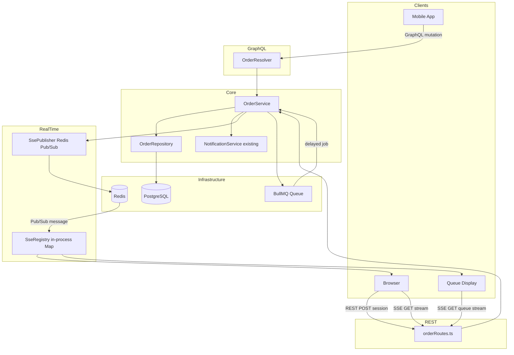
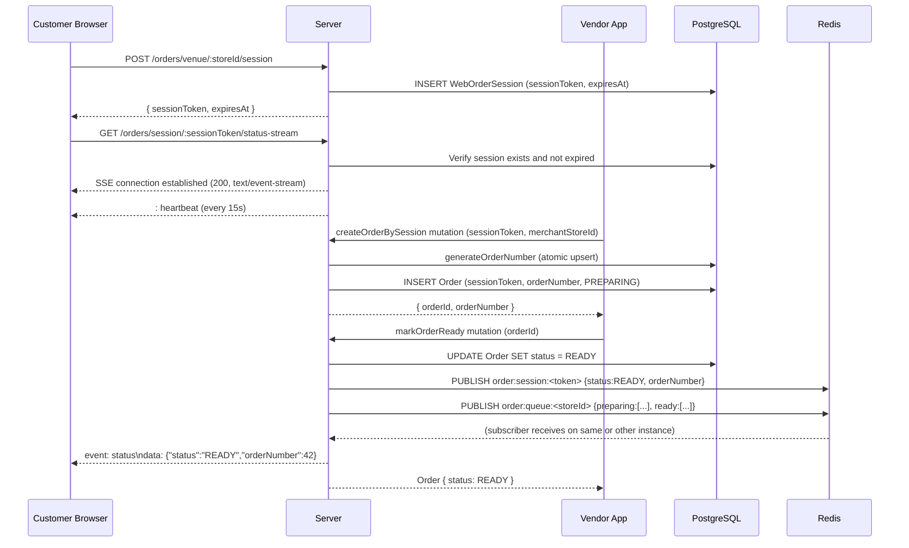

# Design Document — Order Notification System

## Overview

The Order Notification System is a digital replacement for paper-based order number tickets at small food vendor locations. It assigns sequential order numbers to customers and notifies them when their food is ready via three simultaneous modes:

- **Mode 1 (App)**: Vendor scans customer's personal QR code → push notification on order ready
- **Mode 2 (Web)**: Customer scans venue QR code → browser SSE stream for real-time status
- **Mode 3 (Queue)**: Public display screen showing all active orders via SSE stream

All three modes share the same `Order` records and order number sequence per store per day.

The system integrates with the existing Node.js/Express/TypeGraphQL/Prisma/PostgreSQL/BullMQ/Redis stack without modifying existing modules.

## Architecture

### High-Level Module Structure

All new code lives under `src/Order/`. The module follows the existing Resolver → Service → Repository pattern established by `LoyaltyStamps`.

```
src/Order/
  resolver/
    OrderResolver.ts          # TypeGraphQL mutations & queries
  service/
    OrderService.ts           # Business logic: createOrder, markOrderReady, generateOrderNumber
  repository/
    OrderRepository.ts        # Prisma data access + atomic counter upsert
  routes/
    orderRoutes.ts            # Express REST routes (session, queue, SSE, next)
  sse/
    SseRegistry.ts            # In-process SSE connection registry
    SsePublisher.ts           # Redis Pub/Sub publisher/subscriber
  jobs/
    orderJobs.ts              # BullMQ job definitions (auto-archive, session cleanup)
  objectType/
    Order.ts                  # TypeGraphQL ObjectType
    OrderQueue.ts             # TypeGraphQL ObjectType for queue response
  inputType/
    CreateOrderByUserQRInput.ts
    CreateOrderBySessionInput.ts
    MarkOrderReadyInput.ts
```

### Integration with Existing Setup

`src/index.ts` receives two additions:

1. `OrderResolver` added to the `resolvers` array in `tq.buildSchema()`
2. `app.use('/orders', orderRoutes)` registered before `server.applyMiddleware()`

The REST routes use the same `AuthGuard` middleware already used by `/upload`. SSE endpoints do not require authentication for Mode 2/3 (public queue screen) but Mode 1 uses the existing JWT passport middleware.

### Component Diagram



## Data Models

### Prisma Schema Additions

#### New Enum: OrderStatus

```prisma
enum OrderStatus {
  PREPARING
  READY
  PICKED_UP
}
```

#### Extension of NotificationType

Add `ORDER_READY` to the existing `NotificationType` enum in `prisma/schema.prisma`:

```prisma
enum NotificationType {
  // ... existing values ...
  ORDER_READY   // new — order is ready for pickup
}
```

#### New Model: Order

```prisma
model Order {
  id              String        @id @default(uuid())
  merchantStore   MerchantStore @relation(fields: [merchantStoreId], references: [id], onDelete: Cascade)
  merchantStoreId String
  orderNumber     Int
  status          OrderStatus   @default(PREPARING)
  userId          String?       // nullable — Mode 1 only
  sessionToken    String?       // nullable — Mode 2 only
  orderDate       DateTime      // calendar date in merchant-local timezone (date part only)
  createdAt       DateTime      @default(now())
  updatedAt       DateTime      @updatedAt

  @@index([merchantStoreId, createdAt])
  @@index([merchantStoreId, status])
  @@index([sessionToken])
  @@index([userId])
}
```

#### New Model: OrderCounter

```prisma
model OrderCounter {
  id              String   @id @default(uuid())
  merchantStoreId String
  date            DateTime @db.Date   // date only, no time component
  lastNumber      Int      @default(0)
  updatedAt       DateTime @updatedAt

  @@unique([merchantStoreId, date])
}
```

The `@@unique([merchantStoreId, date])` constraint is the anchor for the atomic upsert and satisfies Requirement 13.5.

#### New Model: WebOrderSession

```prisma
model WebOrderSession {
  id              String   @id @default(uuid())
  sessionToken    String   @unique
  merchantStoreId String
  createdAt       DateTime @default(now())
  expiresAt       DateTime

  @@index([sessionToken])
  @@index([expiresAt])
}
```

#### MerchantStore Relation Addition

Add to `MerchantStore` model:

```prisma
orders          Order[]
orderCounters   OrderCounter[]
webOrderSessions WebOrderSession[]
```

## Components and Interfaces

### Order Number Generation

Order numbers are generated atomically in `OrderRepository.generateOrderNumber(merchantStoreId, orderDate)` using a raw SQL upsert. This guarantees uniqueness under concurrent load without application-level locking.

```sql
INSERT INTO "OrderCounter" ("id", "merchantStoreId", "date", "lastNumber", "updatedAt")
VALUES (gen_random_uuid(), $1, $2::date, 1, now())
ON CONFLICT ("merchantStoreId", "date")
DO UPDATE SET "lastNumber" = "OrderCounter"."lastNumber" + 1,
              "updatedAt"  = now()
RETURNING "lastNumber"
```

Executed via `prisma.$queryRaw`. The returned `lastNumber` is the order number for the new order.

**Timezone handling**: `orderDate` is computed in `OrderService` before calling the repository. The merchant's timezone is stored on `MerchantStore` (or falls back to `UTC`). The service uses `dayjs` (already a dependency) with the timezone plugin to convert `new Date()` to the merchant's local calendar date:

```typescript
import dayjs from 'dayjs'
import utc from 'dayjs/plugin/utc'
import timezone from 'dayjs/plugin/timezone'
dayjs.extend(utc)
dayjs.extend(timezone)

const orderDate = dayjs().tz(merchantTimezone).startOf('day').toDate()
```

This means two orders created at 23:59 UTC and 00:01 UTC will land on different `orderDate` values if the merchant's timezone is UTC+1, correctly resetting the counter at local midnight.

### Three-Mode Architecture

#### Mode 1 — App (UserQR)

1. Vendor calls `createOrderByUserQR(input: CreateOrderByUserQRInput)` GraphQL mutation
2. `OrderResolver` extracts the vendor's identity from `ctx.req.user`
3. `OrderService.createOrder()` verifies vendor access to `merchantStoreId` via `MerchantAccessService`
4. `OrderService` verifies the `userQrToken` JWT (signed with `process.env.BE_JWT`, max age 10 min)
5. Extracts `userId` from token payload
6. Calls `OrderRepository.generateOrderNumber()` for the atomic counter
7. Creates `Order` record with `userId` set, `sessionToken` null
8. Returns `{ orderNumber, orderId }`

**UserQRCode JWT**: Signed with `jwt.sign({ userId }, process.env.BE_JWT, { expiresIn: '10m' })`. Verified with `jwt.verify()`. Expired tokens throw `JsonWebTokenError` → mapped to `ErrorWithStatus(401, 'QR code expired')`.

#### Mode 2 — Web (Session)

1. Customer opens browser URL `<BASE_URL>/order/<storeId>` (from VenueQRCode)
2. Browser calls `POST /orders/venue/:storeId/session` → `WebOrderSession` created, `sessionToken` returned
3. Browser connects to `GET /orders/session/:sessionToken/status-stream` (SSE)
4. Vendor calls `createOrderBySession(input: CreateOrderBySessionInput)` GraphQL mutation
5. `OrderService` looks up the session, verifies it is not expired, creates `Order` with `sessionToken` set, `userId` null
6. When vendor calls `markOrderReady`, `SsePublisher` broadcasts to session subscribers

#### Mode 3 — Queue Screen

1. Queue screen connects to `GET /orders/queue/:storeId/stream` (SSE)
2. On connect, the current queue snapshot is sent immediately
3. Any `markOrderReady` call triggers a broadcast to all queue stream subscribers for that store

All three modes share the same `Order` table. The `activeOrders` query and queue endpoint both filter by `merchantStoreId` and `orderDate = today`.

### Real-Time Layer (SSE + Redis Pub/Sub)

#### In-Process SSE Registry

`SseRegistry` maintains two `Map` structures:

```typescript
// sessionToken → Set of Express Response objects
const sessionConnections = new Map<string, Set<Response>>()

// storeId → Set of Express Response objects
const queueConnections = new Map<string, Set<Response>>()
```

When a client connects, its `Response` is added to the appropriate set. When the connection closes (`req.on('close')`), it is removed.

#### Redis Pub/Sub for Multi-Instance Support

`SsePublisher` uses a dedicated Redis subscriber connection (separate from the BullMQ connection to avoid blocking):

- **Channels**:

  - `order:session:<sessionToken>` — session-specific events
  - `order:queue:<storeId>` — store-wide queue events

- **Publish** (in `OrderService.markOrderReady`):

  ```typescript
  await redisPublisher.publish(`order:session:${sessionToken}`, JSON.stringify({ status: 'READY', orderNumber }))
  await redisPublisher.publish(`order:queue:${storeId}`, JSON.stringify(await buildQueuePayload(storeId)))
  ```

- **Subscribe** (in `SsePublisher` startup):
  ```typescript
  redisSubscriber.psubscribe('order:session:*', 'order:queue:*')
  redisSubscriber.on('pmessage', (pattern, channel, message) => {
    if (channel.startsWith('order:session:')) {
      const token = channel.replace('order:session:', '')
      broadcastToSession(token, message)
    } else {
      const storeId = channel.replace('order:queue:', '')
      broadcastToQueue(storeId, message)
    }
  })
  ```

This ensures that even when multiple Node.js instances are running (e.g., PM2 cluster), a `markOrderReady` call on instance A will reach SSE clients connected to instance B.

#### Heartbeat

Each SSE endpoint sets up a `setInterval` (default 15 seconds, configurable via `SSE_HEARTBEAT_MS` env var) that writes `: heartbeat\n\n` to the response. The interval is cleared on connection close.

#### Session Expiry and SSE Cleanup

When a `WebOrderSession` expires, the BullMQ cleanup job calls `SseRegistry.closeSessionConnections(sessionToken)`, which writes a final `event: expired\ndata: {}\n\n` and ends each response.

### REST API Design

All REST routes are registered in `src/Order/routes/orderRoutes.ts` and mounted at `/orders` in `src/index.ts`.

| Method | Path                                          | Auth                         | Description                                 |
| ------ | --------------------------------------------- | ---------------------------- | ------------------------------------------- |
| `POST` | `/orders/venue/:storeId/session`              | None                         | Create WebOrderSession, return sessionToken |
| `GET`  | `/orders/session/:sessionToken`               | None                         | Poll current order status for a session     |
| `GET`  | `/orders/session/:sessionToken/status-stream` | None                         | SSE stream for session order status         |
| `GET`  | `/orders/queue/:storeId`                      | None                         | Snapshot of active orders grouped by status |
| `GET`  | `/orders/queue/:storeId/stream`               | None                         | SSE stream for queue updates                |
| `GET`  | `/orders/:storeId/next`                       | JWT (OWNER/COOPERATOR/ADMIN) | Oldest PREPARING order for the store        |

**POST /orders/venue/:storeId/session** response:

```json
{ "sessionToken": "abc123...", "expiresAt": "2026-03-14T12:00:00Z" }
```

**GET /orders/session/:sessionToken** response:

```json
{ "status": "PREPARING", "orderNumber": 42 }
```

Returns `{ "status": "PENDING" }` if no order has been created for the session yet.

**GET /orders/queue/:storeId** response:

```json
{ "preparing": [34, 35, 36], "ready": [31, 32, 33], "lastReadyOrderNumber": 33 }
```

**SSE event format** (session stream):

```
event: status
data: {"status":"READY","orderNumber":42}

: heartbeat
```

**SSE event format** (queue stream):

```
event: queue
data: {"preparing":[35,36],"ready":[31,32,33,34],"lastReadyOrderNumber":34}

: heartbeat
```

**GET /orders/:storeId/next** response:

```json
{ "orderId": "uuid", "orderNumber": 34, "status": "PREPARING", "createdAt": "..." }
```

Returns `204 No Content` when no PREPARING orders exist.

### GraphQL API Design

#### Object Types

```typescript
@ObjectType()
class Order {
  @Field(() => ID) id: string
  @Field(() => Int) orderNumber: number
  @Field() status: OrderStatus // enum
  @Field({ nullable: true }) userId?: string
  @Field({ nullable: true }) sessionToken?: string
  @Field() merchantStoreId: string
  @Field() orderDate: Date
  @Field() createdAt: Date
  @Field() updatedAt: Date
}

@ObjectType()
class OrderQueueResponse {
  @Field(() => [Int]) preparing: number[]
  @Field(() => [Int]) ready: number[]
  @Field(() => Int, { nullable: true }) lastReadyOrderNumber?: number
}

@ObjectType()
class CreateOrderResult {
  @Field(() => Int) orderNumber: number
  @Field(() => ID) orderId: string
}

@ObjectType()
class VenueQRCodeResult {
  @Field() url: string
  @Field() storeId: string
}

@ObjectType()
class UserQRCodeResult {
  @Field() token: string
  @Field() expiresAt: Date
}
```

#### Input Types

```typescript
@InputType()
class CreateOrderByUserQRInput {
  @Field() userQrToken: string
  @Field() merchantStoreId: string
}

@InputType()
class CreateOrderBySessionInput {
  @Field() sessionToken: string
  @Field() merchantStoreId: string
}

@InputType()
class MarkOrderReadyInput {
  @Field(() => ID) orderId: string
}
```

#### Mutations and Queries

```typescript
@Resolver()
class OrderResolver {
  // Mutations
  @Authorized([Role.OWNER, Role.COOPERATOR, Role.ADMIN])
  @Mutation(() => CreateOrderResult)
  createOrderByUserQR(@Arg('input') input: CreateOrderByUserQRInput, @Ctx() ctx: Context): Promise<CreateOrderResult>

  @Authorized([Role.OWNER, Role.COOPERATOR, Role.ADMIN])
  @Mutation(() => CreateOrderResult)
  createOrderBySession(@Arg('input') input: CreateOrderBySessionInput, @Ctx() ctx: Context): Promise<CreateOrderResult>

  @Authorized([Role.OWNER, Role.COOPERATOR, Role.ADMIN])
  @Mutation(() => Order)
  markOrderReady(@Arg('input') input: MarkOrderReadyInput, @Ctx() ctx: Context): Promise<Order>

  // Queries
  @Authorized([Role.OWNER, Role.COOPERATOR, Role.ADMIN])
  @Query(() => [Order])
  activeOrders(@Arg('merchantStoreId') merchantStoreId: string, @Ctx() ctx: Context): Promise<Order[]>

  @Authorized([Role.OWNER, Role.COOPERATOR, Role.ADMIN])
  @Query(() => VenueQRCodeResult)
  venueQRCode(@Arg('merchantStoreId') merchantStoreId: string, @Ctx() ctx: Context): Promise<VenueQRCodeResult>

  @Authorized([Role.CLIENT])
  @Query(() => UserQRCodeResult)
  myOrderQRCode(@Ctx() ctx: Context): Promise<UserQRCodeResult>
}
```

### WebOrderSession Flow



### Safety and Lifecycle

#### Active Order Limit (Requirement 12)

In `OrderService.createOrder()`, before generating the order number:

```typescript
const activeCount = await prisma.order.count({
  where: {
    merchantStoreId,
    status: { in: ['PREPARING', 'READY'] },
  },
})
const limit = parseInt(process.env.MAX_ACTIVE_ORDERS_PER_STORE ?? '500')
if (activeCount >= limit) {
  throw new ErrorWithStatus(429, 'Too many active orders')
}
```

#### READY → PICKED_UP Auto-Archive (BullMQ Delayed Job)

When `markOrderReady` is called, a BullMQ delayed job is enqueued:

```typescript
await orderArchiveQueue.add(
  'archive-order',
  { orderId },
  { delay: parseInt(process.env.ORDER_ARCHIVE_DELAY_MS ?? String(30 * 60 * 1000)) }
)
```

The worker updates `status` to `PICKED_UP` only if the current status is still `READY` (idempotent check).

#### WebOrderSession TTL Cleanup (BullMQ)

When a session is created, a delayed job is enqueued with delay equal to the session TTL:

```typescript
await sessionCleanupQueue.add('cleanup-session', { sessionToken }, { delay: SESSION_TTL_MS })
```

The worker:

1. Marks the session as expired (or deletes it)
2. Calls `SseRegistry.closeSessionConnections(sessionToken)`

Both queues are defined in `src/Order/jobs/orderJobs.ts` and use the existing `redis` connection from `src/Config/redis.ts`.

## Error Handling

All errors follow the existing `ErrorWithStatus` pattern. The Express error handler in `src/index.ts` already handles these correctly.

| Condition                           | Status | Message                    |
| ----------------------------------- | ------ | -------------------------- |
| Invalid/expired UserQRCode          | 401    | `"QR code expired"`        |
| User not found from QR              | 404    | `"User not found"`         |
| Store not found                     | 404    | `"Store not found"`        |
| Order not found                     | 404    | `"Order not found"`        |
| Session not found                   | 404    | `"Session not found"`      |
| Session expired                     | 410    | `"Session expired"`        |
| Vendor lacks store access           | 403    | `"Access denied"`          |
| Order already READY                 | 409    | `"Order is already ready"` |
| Active order limit reached          | 429    | `"Too many active orders"` |
| No PREPARING orders (next endpoint) | 204    | (no body)                  |

GraphQL errors are thrown as `ErrorWithStatus` instances. The `formatError` function in `ApolloServer` already propagates the `status` field in `extensions.code`.

REST errors are thrown as `ErrorWithStatus` and caught by the Express error handler which returns `{ error, status }` JSON.

## Correctness Properties

_A property is a characteristic or behavior that should hold true across all valid executions of a system — essentially, a formal statement about what the system should do. Properties serve as the bridge between human-readable specifications and machine-verifiable correctness guarantees._

### Property 1: Sequential order numbers per store per day

_For any_ MerchantStore and any sequence of N orders created on the same calendar day, the resulting order numbers should be exactly the set {1, 2, ..., N} with no gaps and no duplicates.

**Validates: Requirements 1.1, 1.4, 1.5**

### Property 2: Concurrent order number uniqueness

_For any_ MerchantStore, when N orders are created concurrently on the same date, all resulting order numbers should be distinct (no two orders share the same order number for the same store on the same date).

**Validates: Requirements 1.2**

### Property 3: orderDate timezone correctness

_For any_ order created at a given UTC timestamp and merchant timezone, the stored `orderDate` should equal the calendar date in the merchant's local timezone, not the UTC date.

**Validates: Requirements 1.6**

### Property 4: Order creation round-trip (UserQR mode)

_For any_ valid UserQR token and accessible merchantStoreId, creating an order should produce an `Order` record with status `PREPARING`, a positive `orderNumber`, the correct `userId`, and `sessionToken` null.

**Validates: Requirements 2.1, 2.2, 8.3**

### Property 5: Session creation does not create an order

_For any_ valid storeId, calling `POST /orders/venue/:storeId/session` should create exactly one `WebOrderSession` record with non-null `sessionToken`, `merchantStoreId`, `createdAt`, and `expiresAt` — and zero `Order` records linked to that session.

**Validates: Requirements 3.1, 3.3, 3.4**

### Property 6: Session-linked order creation round-trip

_For any_ valid, non-expired `WebOrderSession`, calling `createOrderBySession` should produce an `Order` record with the correct `sessionToken`, a positive `orderNumber`, status `PREPARING`, and `userId` null.

**Validates: Requirements 3.5**

### Property 7: Expired session rejects order creation

_For any_ `WebOrderSession` whose `expiresAt` is in the past, attempting to create an order for that session should return HTTP 410 `"Session expired"`.

**Validates: Requirements 3a.2**

### Property 8: markOrderReady transitions status

_For any_ `Order` with status `PREPARING`, calling `markOrderReady` should result in that order having status `READY`. Calling `markOrderReady` on an order already in `READY` status should return HTTP 409.

**Validates: Requirements 6.1, 6.6**

### Property 9: markOrderReady triggers push notification for user-linked orders

_For any_ `Order` with a non-null `userId` that transitions to `READY`, `NotificationService.sendPushNotification` should be called with `type: "ORDER_READY"`, `title: "Your order is ready"`, and `message` containing the order number.

**Validates: Requirements 6.2, 9.1**

### Property 10: markOrderReady broadcasts SSE to all subscribers

_For any_ `Order` that transitions to `READY`, the SSE broadcast should fire on both the session channel (if `sessionToken` is set) and the store queue channel, delivering the correct payload to all connected clients.

**Validates: Requirements 4.2, 5.3, 6.3, 6.4**

### Property 11: Queue response partitions by status and filters to today

_For any_ MerchantStore with a mix of `PREPARING`, `READY`, and `PICKED_UP` orders across multiple dates, the queue response should contain only today's orders, with `PREPARING` orders in the `preparing` array and `READY` orders in the `ready` array, and no `PICKED_UP` orders in either array.

**Validates: Requirements 5.1, 5.6, 8.2**

### Property 12: activeOrders returns today's active orders sorted by orderNumber

_For any_ MerchantStore, `activeOrders` should return only orders with status `PREPARING` or `READY` created today, ordered by `orderNumber` ascending, with no `PICKED_UP` orders included.

**Validates: Requirements 7.1**

### Property 13: venueQRCode URL format and idempotence

_For any_ valid `merchantStoreId`, `venueQRCode` should return a URL matching `<BASE_URL>/order/<storeId>`, and calling it multiple times for the same store should always return the same URL.

**Validates: Requirements 10.1, 10.3**

### Property 14: myOrderQRCode token encodes userId

_For any_ authenticated user with the `CLIENT` role, `myOrderQRCode` should return a JWT that, when decoded, contains the user's `userId` and has an expiry no more than 10 minutes in the future.

**Validates: Requirements 11.1, 11.2**

### Property 15: Active order limit enforced

_For any_ MerchantStore that has reached `MAX_ACTIVE_ORDERS_PER_STORE` active orders (status `PREPARING` or `READY`), attempting to create a new order should return HTTP 429 `"Too many active orders"`.

**Validates: Requirements 12.1**

### Property 16: Next endpoint returns lowest orderNumber PREPARING order

_For any_ MerchantStore with at least one `PREPARING` order, `GET /orders/:storeId/next` should return the order with the lowest `orderNumber` among all `PREPARING` orders. When no `PREPARING` orders exist, it should return HTTP 204.

**Validates: Requirements 14.1, 14.2**

### Property 17: Authorization checks return 403 for unauthorized vendors

_For any_ vendor user who does not have access to a given `merchantStoreId`, all operations that require store access (`createOrderByUserQR`, `createOrderBySession`, `markOrderReady`, `activeOrders`, `venueQRCode`, `GET /orders/:storeId/next`) should return HTTP 403 `"Access denied"`.

**Validates: Requirements 2.4, 6.7, 7.2, 7.3, 10.2, 14.3**

### Property 18: Session polling endpoint reflects current status

_For any_ `WebOrderSession` with a linked `Order`, `GET /orders/session/:sessionToken` should return the current `status` and `orderNumber` of that order. Before an order is linked, it should return `{ status: "PENDING" }`.

**Validates: Requirements 4.5**

## Testing Strategy

### Dual Testing Approach

Both unit tests and property-based tests are required. They are complementary:

- **Unit tests** cover specific examples, integration points, and edge cases
- **Property tests** verify universal correctness across randomly generated inputs

### Property-Based Testing

**Library**: [`fast-check`](https://github.com/dubzzz/fast-check) — the standard PBT library for TypeScript/Node.js.

Install: `npm install --save-dev fast-check`

Each property test must run a minimum of **100 iterations** (fast-check default is 100; increase with `{ numRuns: 200 }` for concurrency tests).

Each test must include a comment referencing the design property:

```typescript
// Feature: order-notification-system, Property 1: Sequential order numbers per store per day
it('generates sequential order numbers starting from 1', async () => {
  await fc.assert(
    fc.asyncProperty(fc.string({ minLength: 1 }), async (storeId) => {
      // arrange: clean counter for storeId
      // act: create N orders
      // assert: order numbers are {1..N}
    }),
    { numRuns: 100 }
  )
})
```

**Property test file locations** (mirror the source structure):

```
src/Order/__tests__/
  OrderService.property.test.ts    # Properties 1, 2, 3, 4, 6, 7, 8, 9, 15
  OrderRoutes.property.test.ts     # Properties 5, 11, 16, 18
  SsePublisher.property.test.ts    # Property 10
  OrderResolver.property.test.ts   # Properties 12, 13, 14, 17
```

### Unit Tests

Unit tests focus on:

- Specific examples demonstrating correct behavior (e.g., exact SSE payload format)
- Integration points (e.g., `NotificationService` is called with exact parameters)
- Edge cases: expired session, already-READY order, no devices registered, empty queue

**Unit test file locations**:

```
src/Order/__tests__/
  OrderService.test.ts             # createOrder, markOrderReady, generateOrderNumber
  OrderRepository.test.ts          # atomic upsert, timezone date computation
  orderRoutes.test.ts              # REST endpoint responses, SSE headers, 204 empty queue
  OrderResolver.test.ts            # GraphQL mutation/query responses
```

### Test Configuration

```javascript
// jest.config.js additions (or separate jest.order.config.js)
{
  testMatch: ['**/Order/__tests__/**/*.test.ts'],
  testEnvironment: 'node',
  setupFilesAfterFramework: ['<rootDir>/src/Order/__tests__/setup.ts']
}
```

The test setup file mocks `prisma`, `NotificationService`, and `SseRegistry` to avoid real database and network calls in unit tests. Property tests that require the atomic counter behavior use a real PostgreSQL test database (or a transaction-wrapped test).

### Coverage Targets

- All 18 correctness properties must have a corresponding property-based test
- Each property-based test must reference its property number in a comment
- Unit tests must cover all error conditions in the error handling table above

## File Structure

All new files to be created:

```
prisma/schema.prisma                          # Modified: add Order, OrderCounter, WebOrderSession models,
                                              #   OrderStatus enum, ORDER_READY to NotificationType

src/Order/
  resolver/
    OrderResolver.ts                          # TypeGraphQL resolver: createOrderByUserQR,
                                              #   createOrderBySession, markOrderReady,
                                              #   activeOrders, venueQRCode, myOrderQRCode
  service/
    OrderService.ts                           # Business logic: createOrder (all modes),
                                              #   markOrderReady, generateOrderNumber,
                                              #   buildQueuePayload, active order limit check
  repository/
    OrderRepository.ts                        # Prisma data access: findOrder, createOrder,
                                              #   updateOrderStatus, generateOrderNumber (raw SQL),
                                              #   findActiveOrders, findNextOrder
  routes/
    orderRoutes.ts                            # Express router: all REST endpoints
  sse/
    SseRegistry.ts                            # In-process Map of session/queue SSE connections,
                                              #   add/remove/broadcast/close methods
    SsePublisher.ts                           # Redis Pub/Sub: publish events, subscribe and
                                              #   forward to SseRegistry
  jobs/
    orderJobs.ts                              # BullMQ queues and workers: archive-order (delayed),
                                              #   cleanup-session (delayed)
  objectType/
    Order.ts                                  # TypeGraphQL @ObjectType for Order
    OrderQueue.ts                             # TypeGraphQL @ObjectType for OrderQueueResponse
    CreateOrderResult.ts                      # TypeGraphQL @ObjectType for mutation result
    VenueQRCodeResult.ts                      # TypeGraphQL @ObjectType for venueQRCode
    UserQRCodeResult.ts                       # TypeGraphQL @ObjectType for myOrderQRCode
  inputType/
    CreateOrderByUserQRInput.ts               # TypeGraphQL @InputType
    CreateOrderBySessionInput.ts              # TypeGraphQL @InputType
    MarkOrderReadyInput.ts                    # TypeGraphQL @InputType
  __tests__/
    OrderService.property.test.ts             # PBT: Properties 1, 2, 3, 4, 6, 7, 8, 9, 15
    OrderRoutes.property.test.ts              # PBT: Properties 5, 11, 16, 18
    SsePublisher.property.test.ts             # PBT: Property 10
    OrderResolver.property.test.ts            # PBT: Properties 12, 13, 14, 17
    OrderService.test.ts                      # Unit: edge cases, error conditions
    OrderRepository.test.ts                   # Unit: atomic upsert, timezone handling
    orderRoutes.test.ts                       # Unit: REST responses, SSE headers
    OrderResolver.test.ts                     # Unit: GraphQL mutation/query responses
    setup.ts                                  # Test setup: mocks for prisma, NotificationService, SseRegistry

src/index.ts                                  # Modified: import OrderResolver, orderRoutes;
                                              #   add to resolvers array and app.use('/orders', ...)
```

### Environment Variables

New environment variables required:

| Variable                      | Default                 | Description                         |
| ----------------------------- | ----------------------- | ----------------------------------- |
| `MAX_ACTIVE_ORDERS_PER_STORE` | `500`                   | Active order limit per store        |
| `ORDER_ARCHIVE_DELAY_MS`      | `1800000` (30 min)      | Delay before READY → PICKED_UP      |
| `SESSION_TTL_MS`              | `7200000` (2 hours)     | WebOrderSession TTL                 |
| `SSE_HEARTBEAT_MS`            | `15000` (15 sec)        | SSE heartbeat interval              |
| `ORDER_BASE_URL`              | `http://localhost:3000` | Base URL for VenueQRCode generation |
