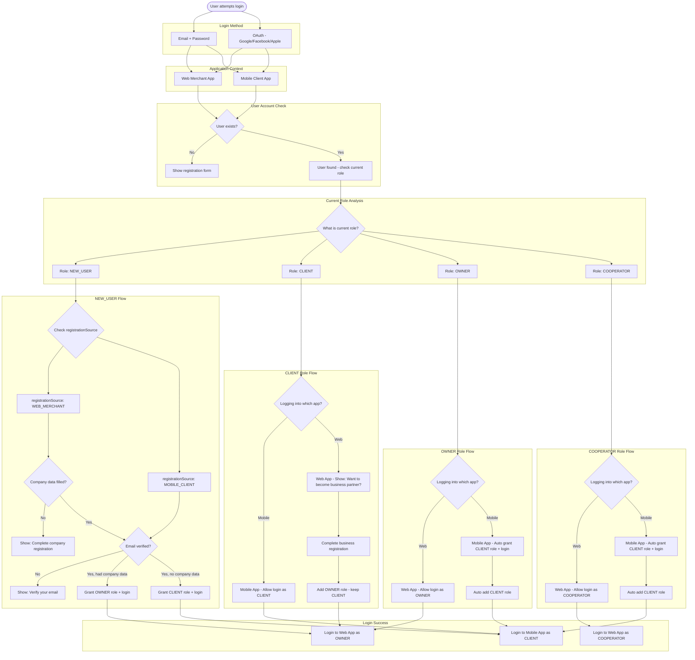
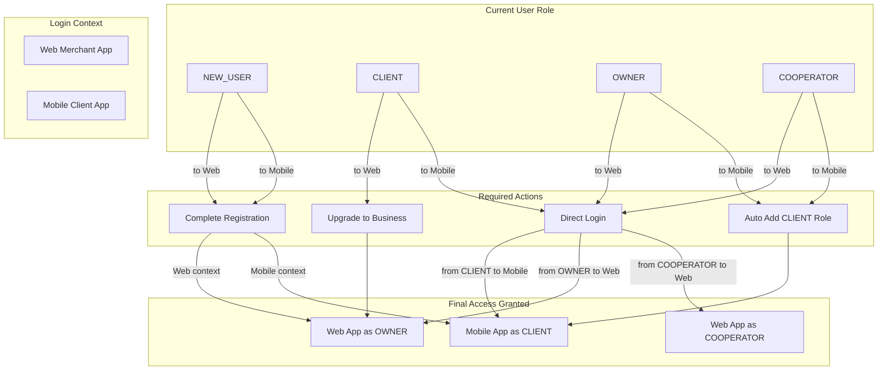
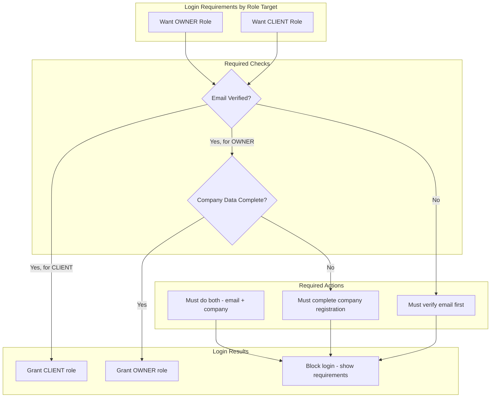
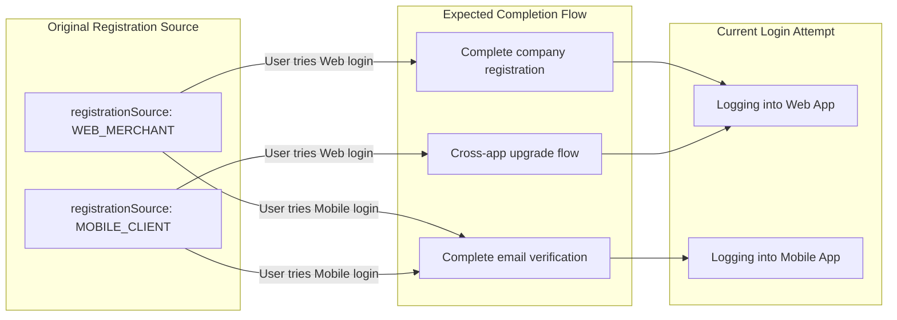

# EasyBons - Login Flow Decision Tree

## Login Flow - Role Assignment Logic

## Role Assignment Matrix

## Email Verification & Company Data Requirements

## Registration Source Impact on Login

