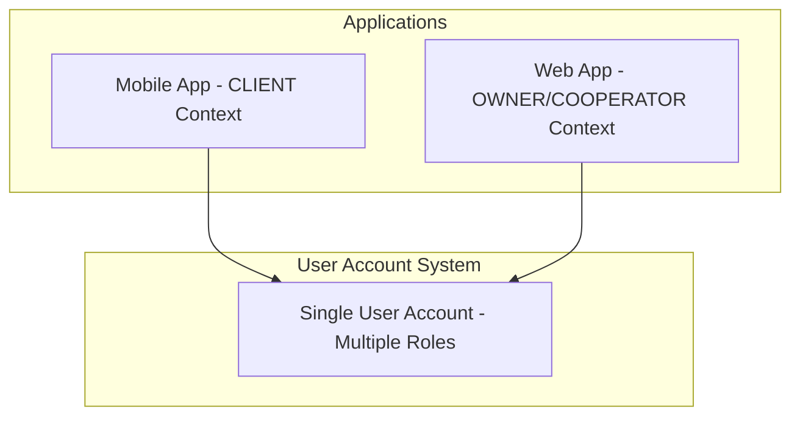
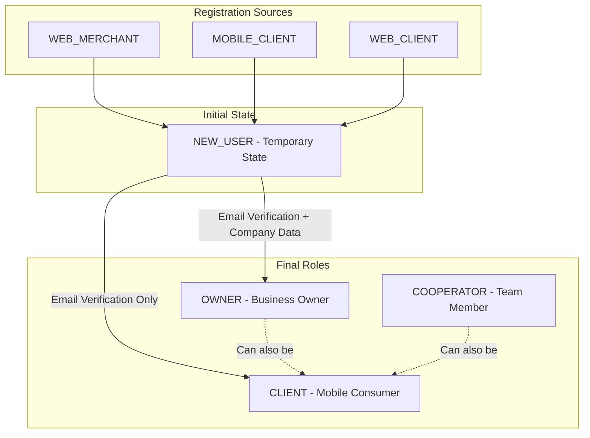
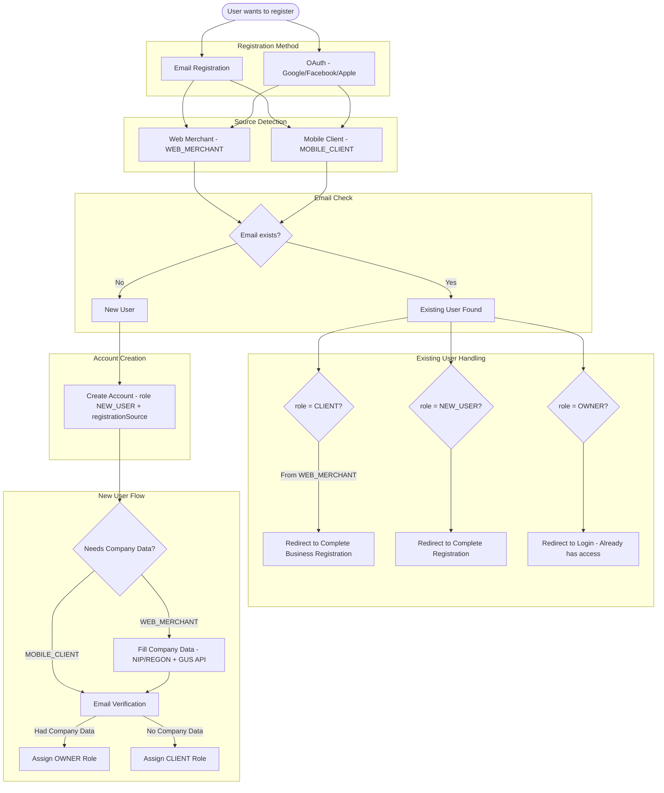
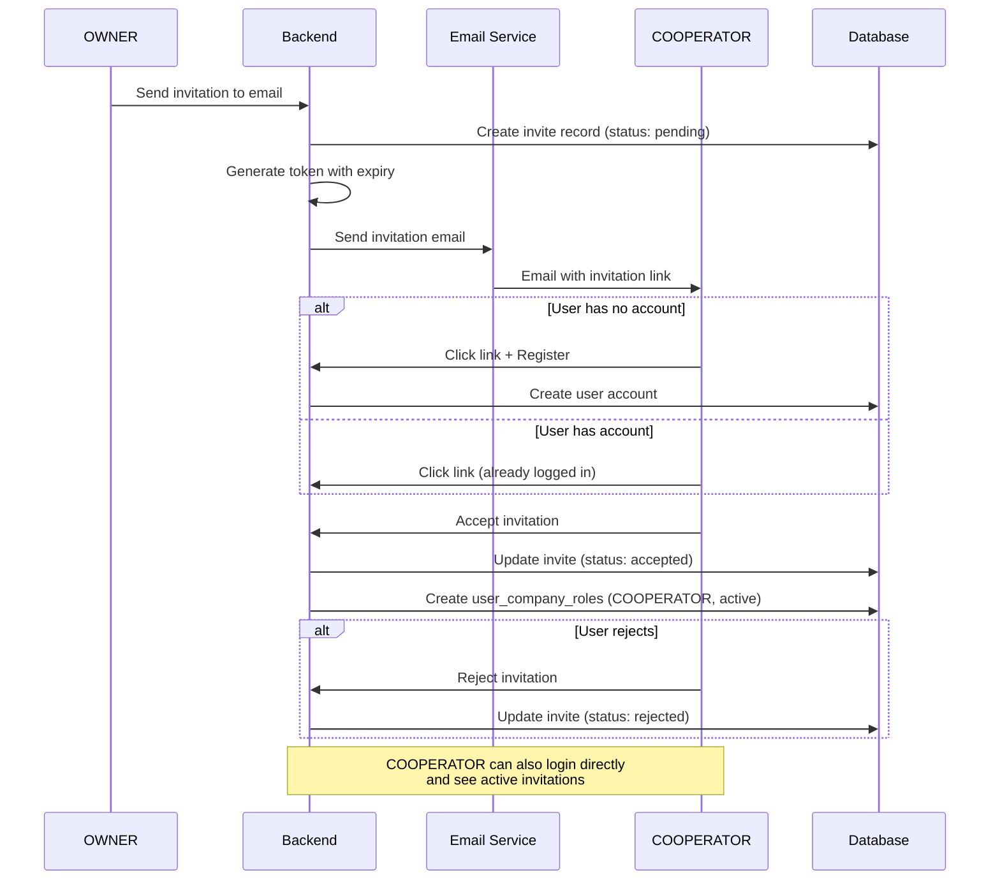
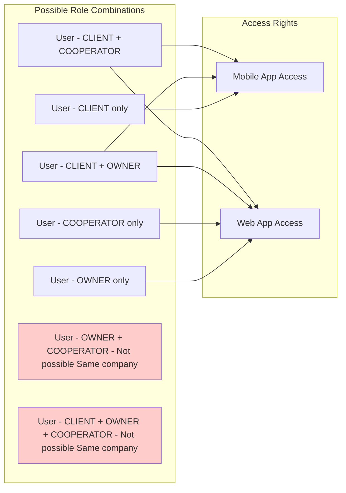
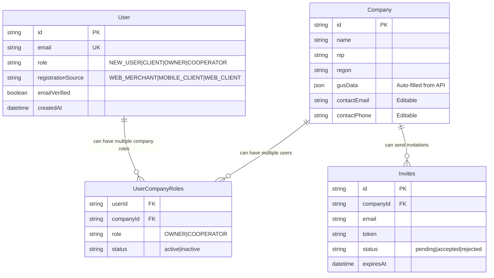

# EasyBons - User Role Flow Diagram

## System Architecture Overview

## Registration Sources & Role Evolution

## Complete Registration Flow

## COOPERATOR Invitation Flow

## Role Combinations Matrix

## Data Model Overview

## Key Benefits Summary

```mermaid
graph TD
    subgraph Benefits[Key Benefits]
        SA[Single Account]
        CS[Context Separation]
        FR[Flexible Roles]
        SR[Smart Registration]
        SEC[Security]
    end

    subgraph SADetails[Single Account Benefits]
        SA1[No multiple logins]
        SA2[Unified experience]
        SA3[Data consistency]
    end

    subgraph CSDetails[Context Separation Benefits]
        CS1[Mobile = Consumer]
        CS2[Web = Business]
        CS3[Natural UX]
    end

    subgraph FRDetails[Flexible Roles Benefits]
        FR1[Role evolution]
        FR2[Multiple roles per user]
        FR3[Business growth support]
    end

    subgraph SRDetails[Smart Registration Benefits]
        SR1[Source tracking]
        SR2[Existing user detection]
        SR3[Seamless upgrades]
    end

    subgraph SECDetails[Security Benefits]
        SEC1[Email verification]
        SEC2[Token-based invites]
        SEC3[Role-based access]
    end

    SA --> SA1
    SA --> SA2
    SA --> SA3

    CS --> CS1
    CS --> CS2
    CS --> CS3

    FR --> FR1
    FR --> FR2
    FR --> FR3

    SR --> SR1
    SR --> SR2
    SR --> SR3

    SEC --> SEC1
    SEC --> SEC2
    SEC --> SEC3
```

