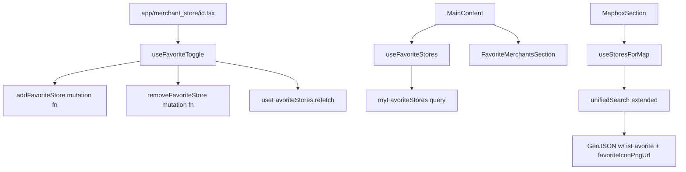

# Design Document: Favorite Stores

## Overview

This feature connects three existing UI surfaces — the store details screen, the home screen favorites section, and the map — to real GraphQL API data. The work is primarily wiring: new GraphQL documents, two small hooks, and prop-threading through existing components. No new navigation patterns, no new libraries.

The core data flow is:
1. `myFavoriteStores` query → `useFavoriteStores` hook → `FavoriteMerchantsSection`
2. `unifiedSearch` (extended with `isFavorite` fields) → `useUnifiedSearch` → map markers
3. `addFavoriteStore` / `removeFavoriteStore` mutations → `useFavoriteToggle` hook → `ActionButtons` on store details screen

---

## Architecture



---

## Components and Interfaces

### New Files

| File | Purpose |
|------|---------|
| `shared/api-client/src/graphql/queries/favoriteStores/query.ts` | `MY_FAVORITE_STORES_QUERY` gql document |
| `shared/api-client/src/graphql/queries/favoriteStores/types.ts` | `FavoriteStore`, `MyFavoriteStoresResponse` types |
| `shared/api-client/src/graphql/queries/favoriteStores/index.ts` | `getFavoriteStores` function via `createGraphQLFunction` |
| `shared/api-client/src/graphql/mutations/addFavoriteStore.ts` | `ADD_FAVORITE_STORE_MUTATION` gql document |
| `shared/api-client/src/graphql/mutations/addFavoriteStoreFunction.ts` | `addFavoriteStore` async function |
| `shared/api-client/src/graphql/mutations/removeFavoriteStore.ts` | `REMOVE_FAVORITE_STORE_MUTATION` gql document |
| `shared/api-client/src/graphql/mutations/removeFavoriteStoreFunction.ts` | `removeFavoriteStore` async function |
| `hooks/useFavoriteStores.ts` | Fetches `myFavoriteStores`, exposes `data`, `loading`, `error`, `refetch` |
| `hooks/useFavoriteToggle.ts` | Optimistic toggle logic, exposes `isFavorite`, `toggle`, `isToggling` |

### Modified Files

| File | Change |
|------|--------|
| `shared/api-client/src/graphql/queries/unifiedSearch/types.ts` | Add `isFavorite`, `favoriteIconUrl`, `favoriteIconPngUrl` to `StoreResult` |
| `shared/api-client/src/graphql/queries/unifiedSearch/unifiedSearch.ts` | Add three fields to `stores {}` in `UNIFIED_SEARCH_FULL_QUERY` |
| `hooks/useUnifiedSearch.ts` | Pass through `isFavorite`, `favoriteIconUrl`, `favoriteIconPngUrl` in `stores` map |
| `components/molecules/MapboxSection.tsx` | Add `favoriteIconPngUrl` to GeoJSON feature properties; load favorite overlay images; add second `SymbolLayer` for the overlay |
| `components/molecules/FavoriteMerchantsSection.tsx` | Accept props, remove hardcoded data, render from API data |
| `components/molecules/MainContent.tsx` | Call `useFavoriteStores`, pass result to `FavoriteMerchantsSection` |
| `components/molecules/MerchantStore/ActionButtons.tsx` | Accept `isFavorite`, `favoriteIconUrl`, `onToggleFavorite`, `isTogglingFavorite` props |
| `app/merchant_store/[id].tsx` | Instantiate `useFavoriteToggle`, wire into `ActionButtons` |

---

## Data Models

### New Types

```typescript
// shared/api-client/src/graphql/queries/favoriteStores/types.ts

export interface FavoriteMerchantStore {
  id: string;
  name: string;
  city: string;
  logoUrl?: string;
  merchant: {
    id: string;
    name: string;
    logoUrl?: string;
  };
}

export interface FavoriteStore {
  id: string;
  merchantStoreId: string;
  createdAt: string;
  merchantStore: FavoriteMerchantStore;
}

export interface MyFavoriteStoresResponse {
  myFavoriteStores: FavoriteStore[];
}

export interface AddFavoriteStoreResponse {
  addFavoriteStore: {
    id: string;
    merchantStoreId: string;
    createdAt: string;
  };
}

export interface AddFavoriteStoreOptions {
  merchantStoreId: string;
  token?: string;
}

export interface RemoveFavoriteStoreOptions {
  merchantStoreId: string;
  token?: string;
}
```

### Extended StoreResult

```typescript
// Addition to existing StoreResult in unifiedSearch/types.ts
export interface StoreResult {
  // ...existing fields...
  isFavorite?: boolean;
  favoriteIconUrl?: string;
  favoriteIconPngUrl?: string;
}
```

### useFavoriteToggle State

```typescript
interface UseFavoriteToggleOptions {
  storeId: string;
  initialIsFavorite: boolean;
  onSuccess?: () => void;
}

interface UseFavoriteToggleResult {
  isFavorite: boolean;
  isToggling: boolean;
  toggle: () => Promise<void>;
}
```

### FavoriteMerchantsSection Props

```typescript
interface FavoriteMerchantsSectionProps {
  favorites: FavoriteStore[];
  loading: boolean;
  onStorePress: (storeId: string) => void;
}
```

### ActionButtons Props (updated)

```typescript
interface ActionButtonsProps {
  isFavorite: boolean;
  favoriteIconUrl?: string;
  isTogglingFavorite: boolean;
  onToggleFavorite: () => void;
  onBuyVoucher: () => void;
}
```

---

## Correctness Properties

*A property is a characteristic or behavior that should hold true across all valid executions of a system — essentially, a formal statement about what the system should do. Properties serve as the bridge between human-readable specifications and machine-verifiable correctness guarantees.*

### Property 1: Store mapping preserves isFavorite with false default

*For any* store result returned by `unifiedSearch`, the mapped store object exposed by `useUnifiedSearch` should have `isFavorite` equal to the API value when present, and `false` when the field is absent or `undefined`.

**Validates: Requirements 1.3, 1.4**

---

### Property 2: GeoJSON feature includes favorite overlay iff isFavorite is true

*For any* store passed to the GeoJSON builder in `MapboxSection`, the resulting feature's `properties.favoriteIconPngUrl` should be a non-empty string when `isFavorite === true` and `favoriteIconPngUrl` is present, and should be absent or empty otherwise (including when `favoriteIconPngUrl` is missing even if `isFavorite === true`).

**Validates: Requirements 2.1, 2.2, 2.4**

---

### Property 3: ActionButtons renders correct icon state for any isFavorite value

*For any* `isFavorite` boolean value passed to `ActionButtons`, the rendered favorite button should use the filled/active icon style when `true` and the outline/inactive style when `false`.

**Validates: Requirements 4.2, 4.3**

---

### Property 4: Toggle immediately flips isFavorite optimistically

*For any* initial `isFavorite` value in `useFavoriteToggle`, calling `toggle()` should synchronously flip `isFavorite` to the opposite value before the API call resolves.

**Validates: Requirements 4.4**

---

### Property 5: API failure reverts isFavorite to original value

*For any* initial `isFavorite` value in `useFavoriteToggle`, if the API call triggered by `toggle()` returns an error, `isFavorite` should revert to the original value it held before `toggle()` was called.

**Validates: Requirements 3.4, 3.5, 3.6, 4.5**

---

### Property 6: isTogglingFavorite disables the favorite button

*For any* `isTogglingFavorite === true` value passed to `ActionButtons`, the favorite button should be in a disabled state (not pressable).

**Validates: Requirements 4.7**

---

### Property 7: Logo resolution uses merchantStore.logoUrl with fallback

*For any* `FavoriteStore` object, the resolved display logo URL should be `merchantStore.logoUrl` when it is a non-empty string, and `merchantStore.merchant.logoUrl` otherwise.

**Validates: Requirements 6.4**

---

## Error Handling

**Optimistic update revert** — `useFavoriteToggle` stores `previousIsFavorite` before flipping state. On any API error it restores that value and surfaces the error message for the screen to display (e.g., via a toast or alert using the existing error display pattern).

**Known API error strings** — `"Store already in favorites"` and `"Store not in favorites"` are treated as silent no-ops (revert without showing an error). `"Store not found"` reverts and shows an error message.

**Missing favoriteIconPngUrl** — When `isFavorite === true` but `favoriteIconPngUrl` is absent or empty, the GeoJSON feature omits the overlay icon key entirely so Mapbox does not attempt to load a broken URI.

**Empty favorites list** — `useFavoriteStores` always returns `data: []` (never `null`) when the query returns an empty array, so `FavoriteMerchantsSection` can safely call `.length` without a null check.

**Unauthenticated state** — `useUnifiedSearch` already guards on `!token` and returns early. The `isFavorite` field will be absent from the response; the mapping defaults it to `false`.

---

## Testing Strategy

### Unit Tests

- `useFavoriteToggle`: example test — given `initialIsFavorite: true`, after a successful `toggle()`, `isFavorite` should be `false`.
- `useFavoriteStores`: example test — when the query returns an empty array, `data` should be `[]`.
- `FavoriteMerchantsSection`: example test — when `loading === true`, renders a loading placeholder; when `favorites === []` and `loading === false`, hides the section.
- `ActionButtons`: example test — given `isFavorite: true`, the favorite button uses the filled icon.

### Property-Based Tests

Use a property-based testing library appropriate for the target environment (e.g., `fast-check` for TypeScript/Jest).

Each property test should run a minimum of **100 iterations**.

Tag format for each test: `Feature: favorite-stores, Property {N}: {property_text}`

| Property | Test description |
|----------|-----------------|
| P1 | Generate random `StoreResult` objects with `isFavorite` present, absent, or `undefined`; assert the mapped output always has a boolean `isFavorite` defaulting to `false` |
| P2 | Generate random store objects with varying `isFavorite` and `favoriteIconPngUrl` combinations; assert GeoJSON `properties.favoriteIconPngUrl` is set iff both conditions hold |
| P3 | Generate random `isFavorite` booleans; render `ActionButtons` and assert the icon name/style matches the expected active/inactive state |
| P4 | Generate random initial `isFavorite` values; call `toggle()` and assert `isFavorite` flips synchronously |
| P5 | Generate random initial `isFavorite` values; simulate API failure after `toggle()`; assert `isFavorite` returns to original value |
| P6 | Generate `isTogglingFavorite: true`; render `ActionButtons` and assert the favorite button is disabled |
| P7 | Generate random `FavoriteStore` objects with varying `logoUrl` presence; assert the resolved logo URL follows the primary-then-fallback rule |
